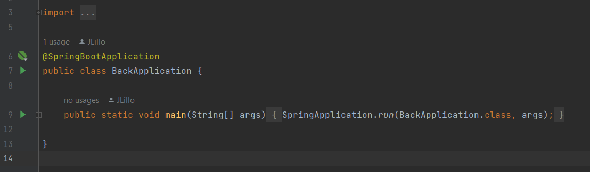

# PruebaTecnica_Base2

El problema a tratar es una plataforma que aministra notas y asistencia en contexto educativo.

Se incluye un diagrama de clase que modela las entidades del backend y la base de datos.
Se incluye un diagrama de secuencia general que muestra  el funcionamiento  de las funciones implementadas.

## Pre Requisitos

* Postgresql 15.1
* Java 17
* npm 10.5.0
* node 20.12.2
* ng: Angular CLI: 17.3.6
* Intellij IDEA (optional)
* Visual Stuido Code (optional)

## Construir Backend

Para construir el proyecto del backend desarrollado en Spring Boot (maven) se recomienda utilizar Intellij IDEA, aunque se puede utilizar otro IDE.

el proyecto se debe  empezar a construir pro defecto al abrirlo en el IDE, si no sucede se recomienda buscar alguna opcion para construir el projecto. En Intellij IDEA ersta opción esta como un martillo en la parte superior.

Tambien debe configurarse la  las propiedades de la aplicacion (application.properties) que se encuentra en la ruta: PruebaTecnica_Base2\back\src\main\resources. Aqui si incluyen principalmente propiedades de  la base de datos, como el nombre y contraseña de postgres, asi como  el puerto local que corre la base de datos. Tambien esta el nombre de base de datos que se utilizará, no es necesario crear las tablas, estas se crearan automaticamente cuando se inicie el proyecto.

## Construir Frontend

Para construir el proyecto del frontend  desarrollado en Angular 17 lo unico que se necesita previo es correr  este comando en la consola en la raiz del proyecto:

```
npm install
```

## Probar Backend

Se incluye pruebas unitarias para los rest controllers desarrollados. Se pueden encontrar en la ruta:
PruebaTecnica_Base2\back\src\test\java\joseLV\back\Controllers

Ahi simplemente se puede dar *Run*  para correr todas las pruebas.

## Probar Frontend

Se incluyen pruebas unitarias para los componentes desarrollados. Para ejecutarlo solo se escribe el siguiente comando en consola, recuerde que es necesario tener instalado el navegador Google Chrome en el sistema

```
ng test
```

## Ejecutar Backend

Para ejecutar el projecto se debe ir al main  y correr la clase principal
el documento principal se encuentra en la ruta:

PruebaTecnica_Base2\back\src\main\java\joseLV\back

En el archivo BackAplication esta la clase principal, notese que a la izquierda hay un triangulo verde el cual debe presionarse para correr el proyecto



## Ejecutar Frontend

Para ejecutar el proyecto se debe escribir el siguiente comando en consola, el proyecto estará corriendo en el puerto  local 4200

```
ng serve
```
